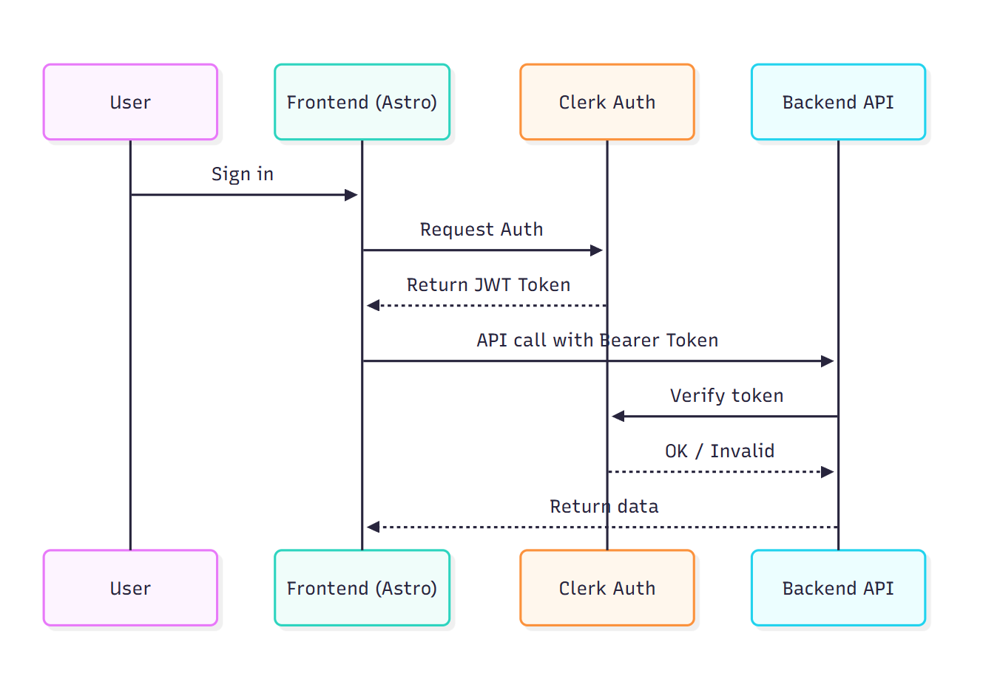

# 🛒 Grocery List App

A full-stack demo web application for managing a personal grocery list. Built with **Astro**, **React**, **TailwindCSS**, and **Clerk** for user authentication.

---

## ✨ Features

- 🔐 Secure login and session management using Clerk
- ✅ Add, remove, tag, and un-tag grocery items
- 👥 User-specific lists — no cross-user access
- ⚡ Built with modern web stack: Astro + React
- 🎨 Responsive and clean UI with TailwindCSS

---

## 🧱 Tech Stack

| Layer    | Technology           |
| -------- | -------------------- |
| Frontend | Astro + React        |
| Auth     | Clerk (hosted auth)  |
| Styling  | TailwindCSS          |
| Backend  | Express.js + MongoDB |
| API Auth | Clerk JWT validation |

---

## 🖼️ Project Structure

Frontend

```bash
src/
├── React/         # React components (GroceryList)
├── layouts/            # Shared layout with Clerk UI
├── pages/              # Astro pages (/ and /groceryList)
├── styles/             # Tailwind (if customized)
middleware.ts
```

Backend

```bash
backend/
├── src/
│   ├── routes/
│   │   └── items.js
│   ├── middleware/
│   │   └── requireAuth.js
│   ├── models/
│   │   └── item.js
│   ├── index.js
├── .env
├── package.json
```

---

## 🚀 Getting Started

### 1. Clone the Repository

```bash
git clone https://github.com/MateoAguirreO/grocery_list.git
cd grocery_list
npm install
```

## 2. Create a .env File

frontend

```bash
CLERK_PUBLISHABLE_KEY=your_clerk_publishable_key
CLERK_SECRET_KEY=your_clerk_secret_key
```

Backend

```bash
PORT=3000
MONGO_URI=your_mongo_uri
CLERK_PUBLISHABLE_KEY=your_clerk_publishable_key
CLERK_SECRET_KEY=your_clerk_secret_key
```

## Software Diagram



## 💡 Improvements & Ideas

✅ Persist item order (e.g., drag-and-drop sorting).

✅ Mark priority levels (high, low).

✅ Responsive design.

✅ Share list via link or email.

🔜 Group items by category (e.g., dairy, produce).

🔜 Offline-first (PWA).
